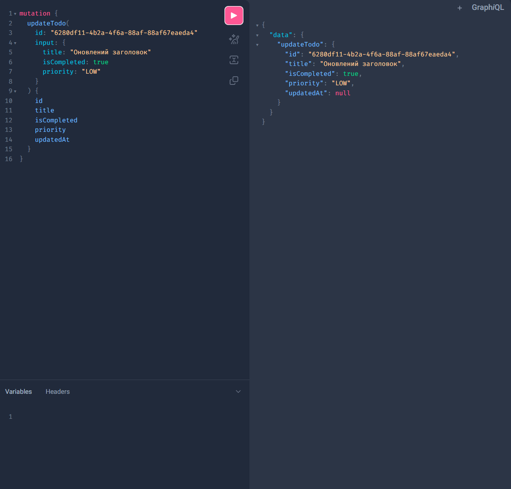
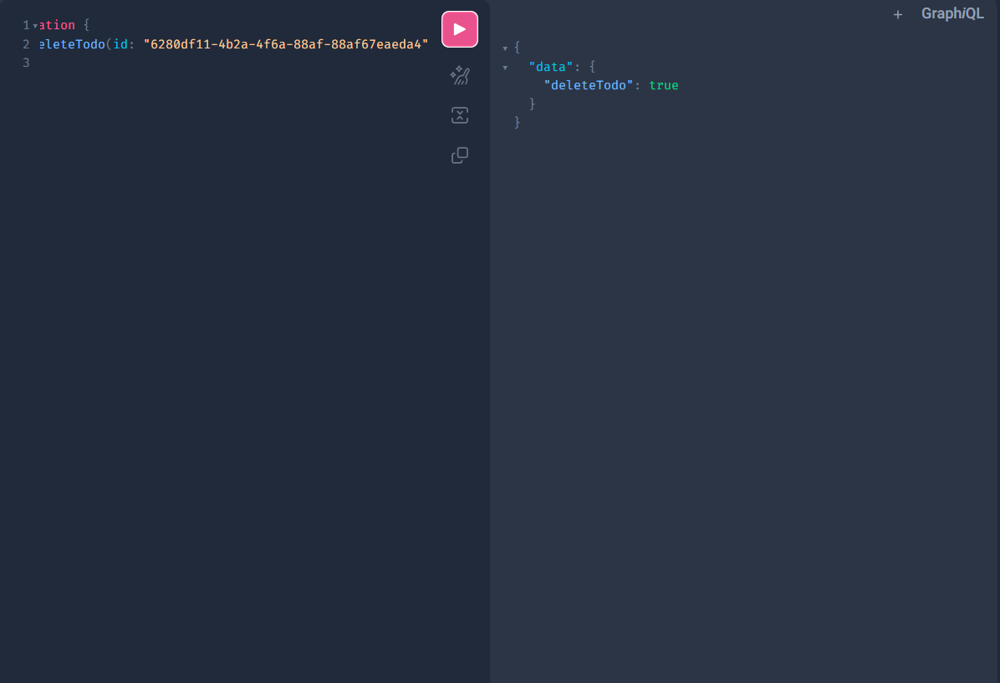
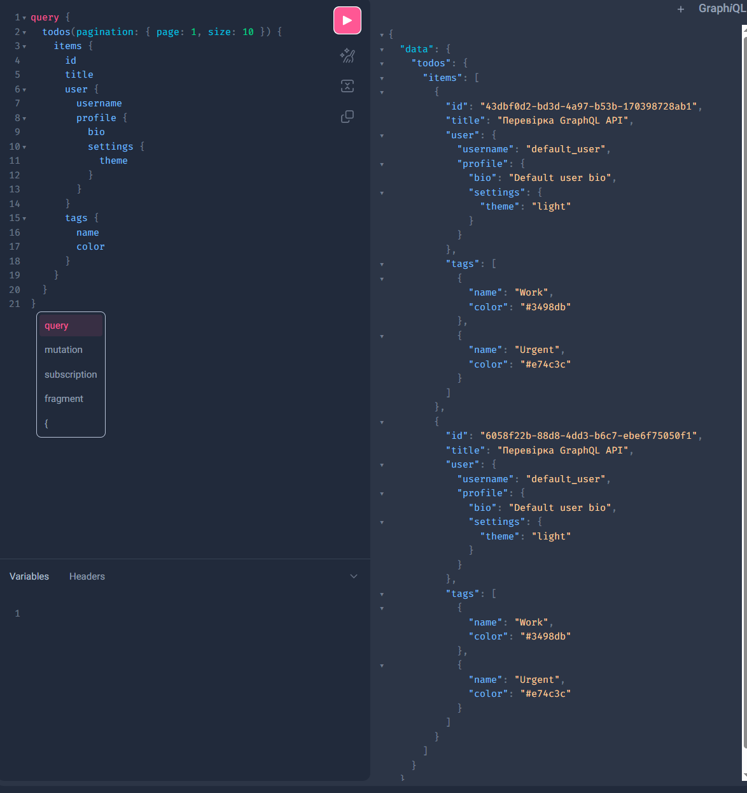
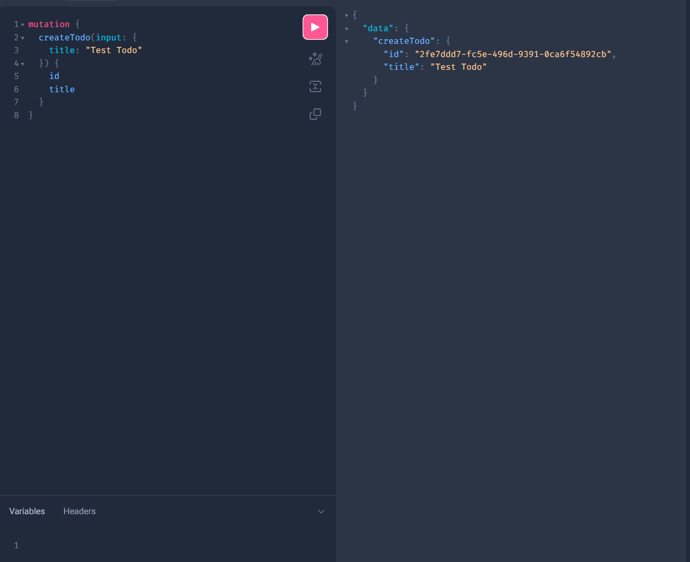

# Звіт до лабораторної роботи

## 1. Мета робо## 5. Опис коду програми

### Основні компоненти:
- **schema.py** — головна GraphQL схема з типами TodoType, UserType, TagType, UserProfileType та всіма операціями
- **dataloaders.py** — UserDataLoader, TagDataLoader, ProfileDataLoader для оптимізації N+1 запитів
- **mock_services.py** — моковані сервіси для демонстрації роботи без реальної БД
- **federation/** — мікросервіси для користувачів та завдань з власними схемами
- **gateway.py** — шлюз для об'єднання федерованих схем

### Ключові особливості реалізації:
- **DataLoader паттерн**: батчинг запитів для уникнення N+1 проблеми
- **Async/await**: асинхронна обробка для кращої продуктивності  
- **Type safety**: сильна типізація через Strawberry GraphQL
- **Event sourcing**: черга подій для real-time subscriptions
- **Federation**: розподіл функціональності між мікросервісами

## 2. Завдання роботи
- Створити GraphQL API з пов'язаними сутностями (Todo, User, Tag)
- Реалізувати глибоку вкладеність (4+ рівні): Todo → User → Profile → Settings
- Впровадити event sourcing з GraphQL subscriptions для real-time оновлень
- Додати повний CRUD функціонал через GraphQL мутації
- Реалізувати пагінацію для ефективної роботи з великими списками
- Використати DataLoader паттерн для оптимізації N+1 проблеми
- Створити GraphQL Federation з мікросервісами

## 3. Оформлення результатів роботи
- **GraphQL схема** (`graphqlapi/schema.py`) з усіма типами, запитами, мутаціями та підписками
- **DataLoader** (`graphqlapi/dataloaders.py`) для оптимізації запитів
- **Федерація** (`federation/`) з окремими мікросервісами для користувачів і завдань
- **Демо файли** (`graphql_demo.py`, `quick_start.py`) для швидкого тестування
- **Документація** з детальними інструкціями запуску та тестування

## 4. Діаграма архітектури GraphQL API

### Основна архітектура:
```
[GraphiQL Client] 
     |
     v
[GraphQL Schema] -----> [DataLoader] -----> [Services]
     |                       |                  |
     v                       v                  v
[Subscriptions] -----> [Event Queue] -----> [Mock Services]
```

### Federation архітектура:
```
[Client] 
     |
     v
[Gateway:8003] -----> [User Service:8002] + [Todo Service:8001]
     |                       |                     |
     v                       v                     v
[Unified Schema]       [User Schema]         [Todo Schema]
```


## 5. Опис коду програми

- **main.py** — точка входу, ініціалізація FastAPI, підключення роутерів, налаштування Jaeger та CORS.
- **routers/todo_router.py** — описані всі REST-ендпоїнти для задач (CRUD), підключення сервісів.
- **models/** — Pydantic-моделі для задач, фільтрів, enum-типів.
- **repositories/todo_repository.py** — логіка зберігання задач у пам’яті, генерація UUID, взаємодія з EventProducer.
- **services/todo_service.py** — бізнес-логіка: фільтрація, сортування, валідація, делегування CRUD-операцій репозиторію.
- **events/event_producer.py** — відправка подій у RabbitMQ.
- **events/outbox.py** — реалізація патерну Outbox.
- **consumer/consumer.py** — окремий сервіс, який отримує події з RabbitMQ, обробляє їх та відправляє трасування у Jaeger.
- **common/** — спільні налаштування, винятки, middleware для обробки помилок.

## 6. Висновки
Успішно реалізовано повнофункціональний GraphQL API з усіма вимогами
Mock-event_producer, graph_demo та файли автоматизації просто стоворені чатиком, та рефакторинг від мене






